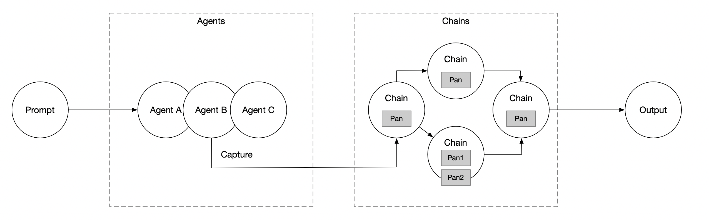

# Prompt Pan

Prompt Pan 是一个基于 TypeScript 开发的 Prompt 工作流：



所有的工作都基于 LLM，根据输入的 Prompt，依次经过 Agent（用于进行意图识别的代理节点），Chain（针对 Agent 提取的信息进行后续操作的节点），最后输出加工后的数据。

## Agent

Agent 适用于进行意图识别的节点，当输入的 Prompt 匹配到对应的 Agent，将被拦截并且由该 Agent 进行加工处理。

```typescirpt
class Agent {
  llm: LLM | null;
  constructor(llm: LLM) {
    this.llm = llm;
  }

  extract(prompt: string): any {
    throw new Error('Not implemented');
  }
}
```

## Chain

Chain 持有一个或多个 Pan（封装任务的基本单元），用于进行任务编排。

```typescript
class Chain {
  private pan: Pan | null;

  constructor(pan?: Pan) {
    this.pan = pan || null;
  }

  async execute(...args: any[]): Promise<any> {
    return this.pan && (await this.pan.call(args[0]));
  }
}
```

## Pan

Pan 是任务执行的最小单元，每个 Pan 实例要实现 `call` 方法，用于实现特定功能。

```typescript
abstract class Pan {
  // 调用下游服务
  public abstract call(...args: any[]): any;
}
```